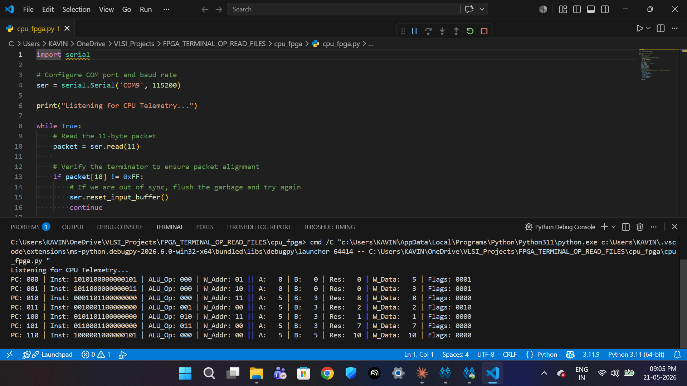
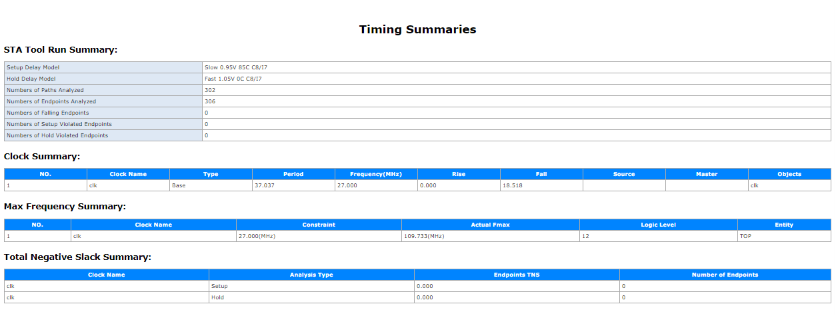

# 8-bit RISC CPU on FPGA

A fully custom 8-bit RISC processor designed in Verilog from scratch,
synthesized and verified on a Sipeed Tang Nano 20K (GW2AR-18 FPGA).
Features a custom ISA, hardware UART telemetry pipeline, and 
real-time CPU state streaming to a Python decoder over USB.



---

## Demo

[▶ Watch the live demo](demo.mp4)

---

## Features

- Custom 16-bit fixed-width ISA with 8 instructions and 4 registers
- Fully pipelined UART telemetry — streams PC, instruction, ALU 
  operands, result, write-back data, and flags per instruction
- 11-byte packetized protocol with 0xFF terminator and 
  auto-resync on misalignment
- Synthesized clean: zero timing violations, Fmax 109MHz 
  at 27MHz operating clock
- Python decoder for live terminal visualization

---

## ISA Reference

| Opcode | Mnemonic | Format | Operation |
|--------|----------|--------|-----------|
| 000 | ADD  | R-type | rd = rs1 + rs2 |
| 001 | SUB  | R-type | rd = rs1 - rs2 |
| 010 | AND  | R-type | rd = rs1 & rs2 |
| 011 | OR   | R-type | rd = rs1 | rs2 |
| 100 | ADDI | I-type | rd = rs1 + imm |
| 101 | MOVI | M-type | rd = imm |
| 110 | NOP  | —      | no operation |
| 111 | HALT | —      | stop execution |

**Instruction Encoding:**
- R-type: [15:13] opcode | [12:11] rd | [10:9] rs1 | [8:7] rs2 | [6:0] unused
- I-type: [15:13] opcode | [12:11] rd | [10:9] rs1 | [8:0] imm
- M-type: [15:13] opcode | [12:11] rd | [10:0] imm

---

## Architecture
┌─────────────────────────────────────────┐
      │              cpu_fpga.v (Top)            │
      │  ┌──────────────────────────────────┐   │
      │  │           cpu.v                  │   │
      │  │  ┌──────┐  ┌──────┐  ┌───────┐  │   │
      │  │  │  PC  │  │ CU   │  │  IM   │  │   │
      │  │  └──────┘  └──────┘  └───────┘  │   │
      │  │         ┌──────────┐             │   │
      │  │         │ Datapath │             │   │
      │  │         │ ALU+RegF │             │   │
      │  │         └──────────┘             │   │
      │  └──────────────┬───────────────────┘   │
      │                 │ telemetry bus          │
      │  ┌──────────────▼───────────────────┐   │
      │  │       uart_sequencer.v            │   │
      │  │  ┌────────────────────────────┐  │   │
      │  │  │       uart_tx.v            │  │   │
      │  │  └────────────────────────────┘  │   │
      │  └──────────────────────────────────┘   │
      └──────────────────────┬──────────────────┘
                             │ PIN69 (TX)
                        BL616 USB Bridge
                             │
                        USB → PC
                             │
                      cpu_fpga.py
                      
                      ---

## UART Telemetry Protocol

Each instruction triggers an 11-byte packet over UART at 115200 baud:

| Byte | Field | Description |
|------|-------|-------------|
| 0 | PC | Program counter value |
| 1 | INSTR[15:8] | Instruction high byte |
| 2 | INSTR[7:0] | Instruction low byte |
| 3 | ALU_A | ALU operand A |
| 4 | ALU_B | ALU operand B |
| 5 | ALU_OP | ALU opcode |
| 6 | ALU_RES | ALU result |
| 7 | W_ADDR | Register write address |
| 8 | W_DATA | Register write data |
| 9 | FLAGS | {halt, overflow, cout, zero} |
| 10 | 0xFF | End-of-packet marker |

---

## Hardware

| Item | Detail |
|------|--------|
| FPGA | GW2AR-LV18-QN88C8/I7 |
| Board | Sipeed Tang Nano 20K |
| Clock | 27MHz crystal → PIN4 |
| UART TX | PIN69 → BL616 → USB |
| Reset | PIN88 (active high, S1 button) |
| LEDs | PIN15–20 (active low) |
| Tool | Gowin EDA V1.9.12.02 SP2 |

---

## Timing Results

| Metric | Value |
|--------|-------|
| WNS | +27.904 ns |
| TNS | 0.000 ns |
| WHS | +0.425 ns |
| Fmax | 109.498 MHz |
| Operating Clock | 27 MHz |
| Timing Violations | 0 |



---

## Verified Execution Trace (Live Hardware)

---

## How to Run

### Prerequisites
- Gowin EDA V1.9.12.02 SP2 or later
- Python 3.x with pyserial: `pip install pyserial`
- Sipeed Tang Nano 20K board

### Synthesize and Flash
1. Open Gowin EDA
2. Add all files from `src/` to project
3. Set top module to `cpu_fpga`
4. Add constraints from `constraints/`
5. Run Synthesize → Place & Route → Generate Bitstream
6. Program device via Gowin Programmer

### Read Telemetry
```bash
python tools/cpu_fpga.py
```
Ensure the correct COM port is set in the script (default: COM9).

---

## Key Design Decisions

**Why case-statement ROM instead of initial begin?**
Gowin EDA's synthesizer crashes on `initial begin` ROM initialization 
with function calls. Case-statement ROM synthesizes cleanly to BSRAM.

**Why was forwarding logic removed?**
The forwarding mux created a combinational loop (AG0100 warning) in 
Gowin's synthesis engine. Removed for clean single-cycle execution.

**Why CLKS_PER_BIT = 234?**
27,000,000 Hz / 115,200 baud = 234.375 → floor to 234 for 
closest baud rate match without oversampling error accumulation.

---

## Author

**Kavin M**  
B.E. ECE, Anna University — MIT Campus, Semester 4  
Interests: VLSI Design, Computer Architecture, AI Hardware  
GitHub: [@sandkavi](https://github.com/sandkavi)